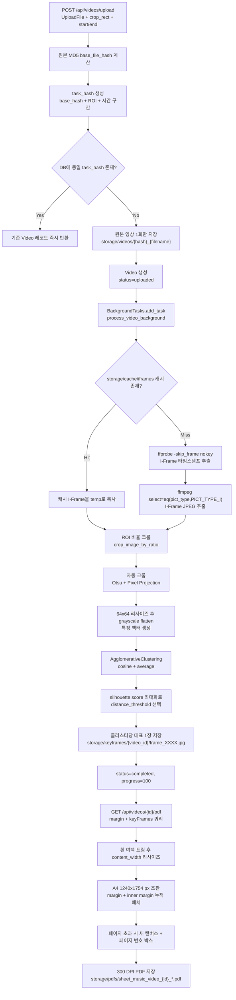

# 프로젝트 명세서 (Sheet Music Keyframe Extractor)

| 항목 | 내용 |
| --- | --- |
| 프로젝트명 | Sheet Music Keyframe Extractor |
| 저장소 경로 | `/home/x/Workspace/sheet-music-extractor` |
| 성격 | 연주 영상에서 악보 프레임을 추출하여 A4 인쇄용 PDF로 조판하는 로컬 단일 사용자 도구 |
| 개발 기간 | 2026-06-08 ~ 2026-06-17 (디렉터 Mike 단독 개발) |
| ATD 편입일 | 2026-09-20 |
| ATD 역할 | 분석, 감사, 문서화 전용. 편입 과정에서 비멱등 삭제 엔드포인트의 HTTP 메서드 전환(GET → DELETE) 1건만 수정했고, 그 외 위반은 수정하지 않고 §4.2 백로그로 이관 |
| 기술 스택 | FastAPI + SQLAlchemy + SQLite + OpenCV + scikit-learn + ffmpeg/ffprobe (backend), React 19 + Vite + Tailwind (frontend) |
| 패키지 관리 | `uv` (`backend/pyproject.toml`, `backend/uv.lock`) |

## 1. Goal & Vision (목표 및 비전)

- 개요: 연주 영상에는 연주자가 화면을 넘기거나 프레임이 흔들리는 구간이 섞여 있어, 그대로 캡처하면 중복 악보와 노이즈가 대량으로 포함된다. 본 프로젝트는 영상에서 악보가 안정적으로 보이는 프레임만 선별하고, 인쇄 가능한 A4 PDF로 자동 조판하여 연습용 악보를 즉시 확보하는 것을 목표로 한다.
- 핵심 해결 과제:
  - 영상 전체 프레임이 아닌 I-Frame 단위로만 후보를 뽑아 연산량을 줄인다.
  - 악보 영역만 잘라내어(ROI + 자동 크롭) 배경, 레터박스, 자막 같은 잡음을 제거한다.
  - 클러스터링으로 동일 악보의 중복 프레임을 하나로 합쳐 페이지 넘김 시점의 악보만 남긴다.
  - 사용자가 포함할 프레임과 여백을 지정해 인쇄 품질의 PDF로 내려받는다.
- 가치: 클라우드 전송 없이 로컬에서 처리하여 영상 데이터가 외부로 나가지 않고, 업로드부터 PDF 다운로드까지 단일 화면에서 완결된다.
- 공식 가이드 및 문서 목록:
  - [README.md](README.md) (영문 개요 및 실행 안내)
  - [README-ko.md](README-ko.md) (한국어 번역본)
  - [AGENTS.md](AGENTS.md) (ATD 공통 SSOT 심볼릭 링크, `/home/x/.agents-hub/core/AGENTS.md` 대상)
  - [PROJECT-DESCRIPTION.md](PROJECT-DESCRIPTION.md) (본 문서)
  - 참고 산출물: `screenshots/screenshot1.png` (UI), `screenshots/screenshot2.png` (생성 PDF)

## 2. Domain & System Mission (도메인 및 시스템 핵심 미션)

- 도메인: 악보 인쇄(paged sheet music) 도메인. 연주 영상의 한 페이지 단위 악보를 인쇄 가능한 단일 평면 페이지로 복원하는 것이 본 시스템의 미션이다.
- 도메인 특화 규칙:
  - 페이지 넘김 검출은 별도 분류기가 아니라 I-Frame 후보를 64x64 grayscale 특징으로 축약한 뒤 계층적 클러스터링으로 근사한다. 동일 클러스터는 동일 악보로 간주하여 대표 1장만 남긴다.
  - 자동 크롭은 Otsu 이진화 후 행/열 픽셀 밀도 프로젝션으로 레터박스와 여백을 제거한다. 밀도 임계 50%, 안전 트림 15px, 잉크 허용치 255x15px, 최종 여백 10px은 모두 코드 상수로 고정되어 있다.
  - PDF 조판 단위는 A4 1240x1754 px, 저장 해상도 300 DPI이다. 프레임은 흰 여백 트림 후 본문 폭에 맞춰 리사이즈되고, 페이지마다 우측 상단에 박스형 페이지 번호가 그려진다.
  - 동일 원본 영상이라도 ROI 또는 시간 구간이 다르면 서로 다른 작업으로 취급한다(`task_hash`).
- 시스템 주요 요구사항 및 제약조건:

| 구분 | 내용 | 근거 |
| --- | --- | --- |
| 런타임 | Python >= 3.12, 외부 바이너리 `ffmpeg` / `ffprobe` 필수 | `backend/pyproject.toml`, `backend/app/services/extractor.py` |
| 저장소 | 로컬 파일시스템 + SQLite 단일 파일(`storage/database/app.db`) | `backend/app/core/database.py` |
| 동시성 | FastAPI BackgroundTasks 단일 프로세스. 작업 큐나 워커 분리 없음 | `backend/app/api/endpoints.py:293` |
| 조판 정밀도 | 300 DPI / A4 1240x1754 px 고정 | `backend/app/api/endpoints.py:22`, `:184` |
| 실행 환경 | 개발 서버 기준(`localhost:5173` UI, `localhost:8000` API) | `backend/app/main.py:25`, `frontend/src/App.jsx:87` |
| 데이터 보존 | 상태 전이 `uploaded` → `processing` → `completed` / `failed`, 진행률 0~100 | `backend/app/services/extractor.py:22` |

## 3. Workflows & Architecture (핵심 워크플로우 및 체계)

### 3.1 핵심 워크플로우 (업로드 → PDF 조판)

- 중복 판정: `task_hash = MD5(base_file_hash + crop_x + crop_y + crop_w + crop_h + start + end)`. 원본 영상 파일은 `base_file_hash` 기준으로 1회만 저장하고, DB 레코드는 `task_hash` 기준으로 분리한다.
- 캐시: I-Frame 원본은 `storage/cache/iframes/{base_hash}_{start}_{end}/`에 타임스탬프 목록과 함께 보존되어 재처리 시 ffmpeg 단계를 건너뛴다.
- PDF 캐시: 파일명에 조판 파라미터(margin 5종 + keyFrames 목록)가 인코딩되어 동일 파라미터 요청은 생성된 파일을 그대로 반환한다.

### 3.2 API 계약

| 메서드 | 경로 | 역할 | 입력 / 출력 |
| --- | --- | --- | --- |
| POST | `/api/videos/upload` | 업로드 + 중복 판정 + 백그라운드 작업 등록 | Form: `file`, `crop_x/y/w/h`, `start_time`, `end_time` → `VideoResponse` |
| GET | `/api/videos/{video_id}` | 처리 상태 및 진행률 폴링 | → `VideoResponse` (진행률 포함) |
| GET | `/api/videos/{video_id}/pdf` | PDF 생성 또는 캐시 반환 | Query: `marginTop/Bottom/Left/Right`, `innerMargin`, `keyFrames` → `FileResponse` |
| DELETE | `/api/videos/{video_id}` | 레코드, 키프레임, PDF, 원본 영상, 캐시 정리 | → 상태 메시지 |
| GET | `/` | 헬스 체크 | → 고정 메시지 |
| 정적 | `/storage` | 추출 이미지 및 PDF 서빙 | StaticFiles 마운트 |

### 3.3 저장소 레이아웃 (SSOT)

| 경로 | 역할 | 관리 주체 |
| --- | --- | --- |
| `backend/storage/videos/` | 업로드 원본 영상 | `save_uploaded_video` |
| `backend/storage/cache/iframes/` | 원본 I-Frame 및 타임스탬프 공용 캐시 | `extract_keyframes_core` |
| `backend/storage/temp/{video_id}/` | 작업별 임시 프레임 (완료 후 강제 삭제) | `process_video_background` |
| `backend/storage/keyframes/{video_id}/` | 최종 선별 악보 프레임 | `extract_keyframes_core` |
| `backend/storage/pdfs/` | 조판된 PDF 산출물 | `save_pdf` |
| `backend/storage/database/app.db` | SQLite 메타데이터 (Video, KeyFrame) | `core/database.py` |

### 3.4 핵심 컴포넌트 계층

| 계층 | 파일 | 책임 |
| --- | --- | --- |
| 진입점 | `backend/app/main.py` | 앱 생성, CORS, 라우터 등록, 정적 마운트, 스토리지 디렉토리 초기화 |
| API | `backend/app/api/endpoints.py` | 업로드/상태/PDF/삭제 엔드포인트, PDF 조판 헬퍼, 해시 및 메타데이터 처리 |
| 서비스 | `backend/app/services/extractor.py` | DB 헬퍼, ffprobe/ffmpeg 래퍼, 크롭, 특징 추출, 클러스터링, 백그라운드 오케스트레이터 |
| 모델 | `backend/app/models/video.py` | `Video`, `KeyFrame` ORM 정의 |
| 스키마 | `backend/app/schemas/video.py` | `VideoResponse`, `KeyFrameResponse` 직렬화 계약 |
| 코어 | `backend/app/core/database.py` | 엔진, 세션, `Base`, `get_db` 의존성 |
| 프론트엔드 | `frontend/src/App.jsx` | 업로드, ROI 드래그 편집, 진행률 폴링, 갤러리, PDF 옵션, 미리보기 전 기능을 담은 단일 컴포넌트 |

### 3.5 에이전트 파이프라인 연계 구조

본 프로젝트는 디렉터 단독 개발 산출물이며, ATD는 기능 구현에 참여하지 않았다. ATD가 편입 과정에서 수행한 코드 수정은 비멱등 삭제 엔드포인트의 HTTP 메서드 전환(GET → DELETE) 1건뿐이고, 그 외 지적사항은 수정하지 않고 §4.2 백로그로 이관했다.

#### 3.5.1 편입 실참여 명단 (2026-09-20)

| 담당 | 직책 | 수행한 작업 |
| --- | --- | --- |
| Atlas | 최고 전략 참모 | 코드베이스 전수 분석, 편입 파이프라인 편성, 기술 케이스 스터디 저술 |
| Leo | 시스템 설계관 | 호출 그래프 및 데이터 흐름 분석, 본 명세서 작성, 개선 백로그 도출 |
| Kai | 백엔드 엔지니어 | 삭제 엔드포인트의 비멱등 HTTP 메서드 위반 해소 (GET → DELETE), 라우트 등록 검증 |
| Sora | 크리에이티브 미디어 디자이너 | 세로 장첩 UI 스크린샷에서 포트폴리오 썸네일(16:9) 판단 크롭, UI/PDF 에셋 제작 |
| Elena | 수석 품질 감사관 | README 서술과 구현 정합성, 300줄 제약 위반, 시크릿/PII 전수 감사 |
| Noah | 테스트 최적화관 | 자동 검증 자산 유무 확인, 백엔드 임포트 및 프론트엔드 빌드 무결성 검증 |

#### 3.5.2 향후 적용 예정 파이프라인

아래 5-Agent 파이프라인은 §4.2 백로그를 별도 승인 후 진행할 때 적용할 편성이며, 편입 시점에 수행된 작업이 아니다. 백로그를 실제로 착수할 때는 해당 단계의 전문 에이전트로 교체 편성한다.

| 단계 | 담당 | 적용 예정 역할 |
| --- | --- | --- |
| 설계 | Leo (시스템 설계관) | 백로그 우선순위 및 모듈 경계 정의 |
| 백엔드 | Kai (백엔드 엔지니어) | 추출 및 조판 파이프라인 결함 수정 |
| 프론트엔드 | Maya (프론트엔드 엔지니어) | `App.jsx` 단일 컴포넌트 분해 |
| 감사 | Elena (수석 품질 감사관) | 수정 산출물 정적 분석 및 PASS/FAIL 판정 |
| QA | Noah (테스트 최적화관) | 최소 검증 집합 수립 및 회귀 검증 |

## 4. Architecture Roadmap (아키텍처 로드맵)

### 4.1 완료된 마일스톤

| 시기 | 내용 | 근거 |
| --- | --- | --- |
| 2026-06-08 | 프론트엔드 초기 구성(Vite + React), 저장소 부트스트랩 | 최초 커밋 |
| 2026-06-12 | 키프레임 추출 전략 테스트 및 scikit-learn 클러스터링 도입 | 커밋 `2f406fb` |
| 2026-06-14 | Python 3.14 → 3.12 다운그레이드로 Linux 세그멘테이션 폴트 해결 | 커밋 `cd556bf` |
| 2026-06-16 | 백엔드/프론트엔드 실행 스크립트, ROI, 시간 구간, 캐시 구조 정비 | 커밋 `31242e7` 외 |
| 2026-06-17 | PDF 조판 및 UI 마감 | 커밋 `47af4f3` |
| 2026-09-20 | ATD 허브 편입, 본 명세서 작성, 감사 지적사항 백로그화 | 본 문서 |
| 2026-09-20 | 편입 빌드 무결성 검증: 백엔드 임포트 성공, 프론트엔드 빌드 성공(161ms), 포트폴리오 산출물 8종 검증 통과, 자동 테스트 0건 소견 재확인 | 검증 실행 로그 (Noah) |

### 4.2 개선 백로그 (감사 지적사항)

아래 항목은 품질 감사에서 사실 확인된 지적사항만 정리한 것이다. 추측 항목은 포함하지 않았다. 편입 감사는 총 16건을 적발했고, 이 중 비멱등 삭제 엔드포인트의 GET → DELETE 전환 1건은 편입 과정에서 해소했다. 나머지 15건이 아래 백로그이며, 번호는 기술 케이스 스터디(`docs/PROJECT-PROMOTION.md` §4)의 분류와 대응한다.

| ID | 분류 | 지적사항 | 근거 | 권고 조치 |
| --- | --- | --- | --- | --- |
| BL-01 | 문서/배포 | README의 설치 절차와 Prerequisites가 실제 요구사항과 어긋난다. `requirements.txt`가 존재하지 않고, Prerequisites는 `Python 3.8+`로 적혀 있으나 실제 요구는 `>=3.12`이며, 하드 런타임 의존인 `ffmpeg`/`ffprobe`가 Prerequisites에 없다 | `backend/requirements.txt` 부재, `README.md:75` · `README-ko.md:78` (Python 3.8+) 대비 `backend/pyproject.toml:6` (`requires-python = ">=3.12"`), `backend/app/services/extractor.py:39-45`, `:58` (subprocess 직접 호출) | README를 `uv sync` 및 `pyproject.toml` 기준으로 정정하고 Python 버전과 ffmpeg/ffprobe 의존을 Prerequisites에 명시 |
| BL-02 | 기능 정합성 | README의 "개별 이미지 삭제"가 프론트엔드에 미구현이고 백엔드 엔드포인트만 존재한다 | `backend/app/api/endpoints.py` 삭제 핸들러 존재, `frontend/src/App.jsx` 갤러리에 삭제 UI 부재 | 갤러리 썸네일에 삭제 액션 추가 또는 README 서술 철회 |
| BL-03 | 기능 정합성 | README의 "이미지 순서 바꾸기"가 미구현이다. 선택 인덱스 오름차순으로 고정된다 | `frontend/src/App.jsx:802` 정렬 후 전송, 재정렬 UI 없음 | 드래그 재정렬 도입 또는 README에서 순서 기능 삭제 |
| BL-04 | 기능 정합성 | README의 테스트 영상 자동 업로드 버튼이 미구현이다. 대상 디렉토리 자체가 없다 | `frontend/public/data/` 부재 (`frontend/public`에는 `favicon.svg`, `icons.svg`만 존재) | 테스트 자산 디렉토리 및 업로드 버튼 구현 또는 README 절차 삭제 |
| BL-05 | 신뢰성 | README의 "retry strategies"가 미구현이다. retry/backoff 로직이 0건이다 | `backend/app`, `frontend/src` 전체에서 retry 및 backoff 심볼 미검출 | ffmpeg/ffprobe 호출에 재시도 및 백오프 도입 또는 README 서술 정정 |
| BL-06 | 문서 정확성 | README의 "AI/heuristics 페이지 넘김 검출" 서술이 실제 구현보다 과장되었다 | 실제 구현은 I-Frame 클러스터링(`backend/app/services/extractor.py:157-184`)이며 학습 모델이나 페이지 넘김 분류기는 없음 | 서술을 "I-Frame 클러스터링 기반 중복 악보 제거"로 정정 |
| BL-07 | 구조 제약 | `App.jsx`가 1349행 단일 컴포넌트이고 하위 컴포넌트가 0개다 (ATD 물리 제약 300줄 위반) | `frontend/src/App.jsx` | 업로드, ROI, 갤러리, PDF 옵션, 미리보기 단위로 컴포넌트 분해 |
| BL-08 | 구조 제약 | 백엔드 핵심 파일이 300줄 제약을 위반한다 | `backend/app/api/endpoints.py` 396행, `backend/app/services/extractor.py` 344행 | 해시, 조판, 크롭 등 관심사별 모듈 분리 |
| BL-09 | 테스트 | 자동 테스트가 0건이고 테스트 프레임워크가 미도입이다 | 수동 CLI 하네스 `backend/test_strategy.py` 1개, 5행 스텁 `backend/test_minimal.py` 1개 | pytest 도입 후 클러스터링 임계 선택, PDF 조판, 해시 중복 판정에 최소 테스트 추가 |
| BL-10 | 설정 | CORS 허용 오리진과 프론트 API 주소가 하드코딩되어 있다 | `backend/app/main.py:25`, `frontend/src/App.jsx:87-88` | 환경변수 기반 설정으로 전환 |
| BL-11 | 신뢰성 | FastAPI BackgroundTasks 단일 프로세스 구조라 서버 재시작 시 진행 중 작업이 유실된다 | `backend/app/api/endpoints.py:293` | 작업 큐(예: Redis + 워커) 도입 또는 재시작 시 `processing` 상태 복구 로직 추가 |
| BL-12 | 관측성 | 예외를 print만 하고 status만 failed로 기록한다. 에러 메시지가 저장되지 않는다 | `backend/app/services/extractor.py:335-338` | Video에 에러 메시지 및 스택 필드 추가, 구조적 로깅 도입 |
| BL-13 | 유지보수 | `sqlalchemy.ext.declarative.declarative_base`를 사용한다 (SQLAlchemy 2.x 비권장 경로) | `backend/app/core/database.py:3`, `:14` | `sqlalchemy.orm.declarative_base`로 이행 |
| BL-14 | 설정 | `frontend/pyproject.toml`이 uv 오작동 잔재다. `requires-python = ">=3.14"`에 dependencies가 비어 있다 | `frontend/pyproject.toml:6` | 파일 삭제 (프론트엔드는 npm 기반) |
| BL-15 | 배포/CI | Dockerfile 및 CI 파이프라인이 부재하다 | `Dockerfile`, `backend/Dockerfile`, `.github/` 모두 없음 | 컨테이너 정의 및 빌드/린트 자동화 파이프라인 신설 |

### 4.3 권고 진행 순서

| 순서 | 묶음 | 대상 ID | 비고 |
| --- | --- | --- | --- |
| 1 | 문서 정합성 복구 | BL-01, BL-05, BL-06 | 코드 변경 없이 README와 실제 구현을 일치시킨다 |
| 2 | 관측성 및 신뢰성 | BL-11, BL-12 | 실패 원인 추적과 작업 유실 방지를 우선 확보한다 |
| 3 | 테스트 기반 마련 | BL-09 | 이후 리팩토링의 회귀 안전망을 먼저 세운다 |
| 4 | 구조 분해 | BL-07, BL-08 | 테스트 확보 후 컴포넌트 및 모듈 분해를 진행한다 |
| 5 | 미구현 기능 정합화 | BL-02, BL-03, BL-04 | README 기능을 구현하거나 서술을 철회한다 |
| 6 | 설정 및 배포 정비 | BL-10, BL-13, BL-14, BL-15 | 환경 분리와 배포 자동화로 마무리한다 |

- 6개 묶음은 모두 디렉터의 별도 승인 후 진행하며, 각 묶음은 독립 검증 단위로 분리한다. 편입 시점에는 백로그를 착수하지 않았고 비멱등 삭제 1건만 해소했다.
