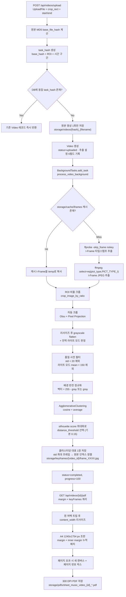

# 프로젝트 명세서 (Sheet Music Keyframe Extractor)

| 항목 | 내용 |
| --- | --- |
| 프로젝트명 | Sheet Music Keyframe Extractor |
| 저장소 경로 | `/home/x/Workspace/sheet-music-extractor` |
| 성격 | 연주 영상에서 악보 프레임을 추출하여 A4 인쇄용 PDF로 조판하는 로컬 단일 사용자 도구 |
| 디렉터 개발 기간 | 2026-06-08 ~ 2026-06-23 (16일, 디렉터 Mike 단독 개발) |
| 디렉터 커밋 수 | 34건 (최초 `d26220c` 2026-06-08, 최종 `314042f` 2026-06-23). 저장소 전체 37건 |
| ATD 편입일 | 2026-09-20 |
| ATD 역할 | 분석, 감사, 문서화 전용. 편입 과정에서 결함 2건(백엔드 라우트 1건, 프론트 호출부 1건)을 수정했고, 그 외 지적사항은 수정하지 않고 §4.2 백로그로 이관 |
| 코드 규모 | backend/app Python 964행 + frontend/src JS/JSX 1,544행 = 합계 2,508행 |
| 기술 스택 | FastAPI + SQLAlchemy + SQLite + OpenCV + scikit-learn + ffmpeg/ffprobe (backend), React 19 + Vite + Tailwind (frontend) |
| 패키지 관리 | `uv` (`backend/pyproject.toml`, `backend/uv.lock`), `npm` (frontend) |

## 1. Goal & Vision (목표 및 비전)

- 개요: 연주 영상에는 연주자가 화면을 넘기거나 프레임이 흔들리는 구간이 섞여 있어, 그대로 캡처하면 중복 악보와 노이즈가 대량으로 포함된다. 본 프로젝트는 영상에서 악보가 안정적으로 보이는 프레임만 선별하고, 인쇄 가능한 A4 PDF로 자동 조판하여 연습용 악보를 즉시 확보하는 것을 목표로 한다.
- 핵심 해결 과제:
  - 영상 전체 프레임이 아닌 I-Frame 단위로만 후보를 뽑아 연산량을 줄인다.
  - 악보 영역만 잘라내어(ROI + 자동 크롭) 배경, 레터박스, 자막 같은 잡음을 제거한다.
  - 밝기 정규화와 품질 사전 필터로 어두운 인트로, 페이드, 검은 아웃트로 프레임을 먼저 걷어낸다.
  - 클러스터링으로 동일 악보의 중복 프레임을 하나로 합치고, 클러스터마다 대비가 가장 선명한 프레임을 대표로 남긴다.
  - 사용자가 포함할 프레임과 여백을 지정해 인쇄 품질의 PDF로 내려받는다.
- 가치: 클라우드 전송 없이 로컬에서 처리하여 영상 데이터가 외부로 나가지 않고, 업로드부터 PDF 다운로드까지 단일 화면에서 완결된다.
- 공식 가이드 및 문서 목록:
  - [README.md](README.md) (영문 개요 및 실행 안내)
  - [README-ko.md](README-ko.md) (한국어 번역본)
  - [AGENTS.md](AGENTS.md) (ATD 공통 SSOT 심볼릭 링크, `/home/x/.agents-hub/core/AGENTS.md` 대상)
  - [docs/PROJECT-PROMOTION.md](docs/PROJECT-PROMOTION.md) (편입 기술 케이스 스터디)
  - [PROJECT-DESCRIPTION.md](PROJECT-DESCRIPTION.md) (본 문서)
  - 참고 산출물: `screenshots/screenshot1.png` (UI), `screenshots/screenshot2.png` (생성 PDF)

## 2. Domain & System Mission (도메인 및 시스템 핵심 미션)

- 도메인: 악보 인쇄(paged sheet music) 도메인. 연주 영상의 한 페이지 단위 악보를 인쇄 가능한 단일 평면 페이지로 복원하는 것이 본 시스템의 미션이다.
- 도메인 특화 규칙:
  - 전역 밝기 정규화: 추출된 유효 프레임들의 평균 밝기 중앙값이 127을 넘으면 전역 라이트 모드로 판정하고, 이후 모든 프레임의 특징 벡터를 반전한다. 결과적으로 흰 종이 악보와 검은 배경 악보를 동일한 부호 공간으로 정렬한다.
  - 품질 사전 필터: 표준편차가 20 미만인 프레임(단색에 가까운 인트로, 페이드 전환, 검은 아웃트로)과, 전역 라이트 모드에서 평균 밝기가 150 미만인 프레임을 클러스터링 대상에서 제외한다. 이것이 클러스터 붕괴를 막는 실제 방어선이다.
  - 페이지 넘김 검출은 별도 분류기가 아니라 I-Frame 후보를 리사이즈 후 grayscale 로 축약한 특징 벡터를 계층적 클러스터링으로 근사한다. 동일 클러스터는 동일 악보로 간주하여 대표 1장만 남긴다.
  - 대표 프레임 선택은 클러스터의 첫 프레임이 아니라 표준편차가 최대인 프레임(=배경과 기보의 대비가 가장 선명한 프레임)을 고른다. 이후 원본 인덱스 기준으로 다시 정렬해 타임라인 순서를 복원한다.
  - 자동 크롭은 Otsu 이진화 후 행/열 픽셀 밀도 프로젝션으로 레터박스와 여백을 제거한다. 밀도 임계 50%, 안전 트림 15px, 잉크 허용치 255x15px, 최종 여백 10px은 모두 코드 상수로 고정되어 있다.
  - PDF 조판 단위는 A4 1240x1754 px, 저장 해상도 300 DPI이다. 프레임은 흰 여백 트림 후 본문 폭에 맞춰 리사이즈되고, 페이지마다 우측 상단에 박스형 페이지 번호가 그려진다.
  - 동일 원본 영상이라도 ROI 또는 시간 구간이 다르면 서로 다른 작업으로 취급한다(`task_hash`). ROI·시간 구간은 추출 설정 6필드(`crop_x`, `crop_y`, `crop_w`, `crop_h`, `start_time`, `end_time`)로 레코드에 영속화되어, 재업로드 없이 동일 `task_hash` 결과를 복원할 수 있다.
- 시스템 주요 요구사항 및 제약조건:

| 구분 | 내용 | 근거 |
| --- | --- | --- |
| 런타임 | Python >= 3.12, 외부 바이너리 `ffmpeg` / `ffprobe` 필수 | `backend/pyproject.toml`, `backend/app/services/extractor.py:39-45`, `:58-71` |
| 저장소 | 로컬 파일시스템 + SQLite 단일 파일(`storage/database/app.db`) | `backend/app/core/database.py` |
| 동시성 | FastAPI BackgroundTasks 단일 프로세스. 작업 큐나 워커 분리 없음 | `backend/app/api/endpoints.py:258`, `:311` |
| 조판 정밀도 | 300 DPI / A4 1240x1754 px 고정 | `backend/app/api/endpoints.py:22-23`, `:184-185` |
| 실행 환경 | 개발 서버 기준(`localhost:5173` UI, `localhost:8000` API) | `backend/app/main.py:25`, `frontend/src/App.jsx:89` |
| 데이터 보존 | 상태 전이 `uploaded` → `processing` → `completed` / `failed`, 진행률 0~100 | `backend/app/services/extractor.py:22` |
| 진행률 보고 | FFmpeg 추출 구간에서 30~70%, 키프레임 저장 구간에서 75~95%를 실시간 반영 | `backend/app/services/extractor.py:255-256`, `:331-332` |

## 3. Workflows & Architecture (핵심 워크플로우 및 체계)

### 3.1 핵심 워크플로우 (업로드 → PDF 조판)

- 중복 판정: `task_hash = MD5(base_file_hash + crop_x + crop_y + crop_w + crop_h + start + end)`. 원본 영상 파일은 `base_file_hash` 기준으로 1회만 저장하고, DB 레코드는 `task_hash` 기준으로 분리한다.
- 캐시: I-Frame 원본은 `storage/cache/iframes/{base_hash}_{start}_{end}/`에 타임스탬프 목록과 함께 보존되어 재처리 시 ffmpeg 단계를 건너뛴다.
- PDF 캐시: 파일명에 조판 파라미터(margin 5종 + keyFrames 목록)가 인코딩되어 동일 파라미터 요청은 생성된 파일을 그대로 반환한다.
- 2026-06-19 ~ 06-23 변경으로 알고리즘이 다음과 같이 달라졌다. 이전 구현은 클러스터의 첫 프레임을 대표로 삼고 임계 후보 `[0.01, 0.02, 0.03, 0.04, 0.05, 0.08, 0.1]` / 기본값 `0.03`을 사용했으며 밝기 정규화와 품질 필터가 없었다. 현재는 아래와 같다.

| 항목 | 6월 23일 이전 | 현재 | 근거 |
| --- | --- | --- | --- |
| 임계값 후보 | `[0.01, 0.02, 0.03, 0.04, 0.05, 0.08, 0.1]` | `[0.05, 0.08, 0.1, 0.12, 0.15, 0.18, 0.2]` | `extractor.py:157` |
| 임계값 기본/Fallback | `0.03` | `0.15` | `extractor.py:158` |
| 대표 프레임 | 클러스터 첫 프레임 | 표준편차 최대 프레임, 이후 원본 인덱스 정렬 | `extractor.py:305-307`, `:310` |
| 밝기 정규화 | 없음 | `global_light_mode = np.median(means) > 127.0` 후 반전 | `extractor.py:263`, `:282` |
| 품질 사전 필터 | 없음 | `std_val < 20.0` 제외, 라이트 모드에서 `mean_val < 150.0` 제외 | `extractor.py:272`, `:276` |
| 진행률 보고 | 고정 단계값 | FFmpeg 30~70%, 저장 75~95% 실시간 반영 | `extractor.py:255-256`, `:331-332` |

- 6월 19일 이후 변동이 없는 구간은 다음과 같다. ffprobe I-Frame 타임스탬프 추출(`extractor.py:38-53`), ffmpeg I-Frame JPEG 추출(`extractor.py:57-71`), ROI 비율 크롭(`extractor.py:73-89`), Otsu 기반 자동 크롭(`extractor.py:92-155`), MD5 해시 및 중복 판정(`endpoints.py:269-279`), PDF 조판 전체(`endpoints.py:41-186`).

### 3.2 API 계약

| 메서드 | 경로 | 역할 | 입력 / 출력 | 근거 |
| --- | --- | --- | --- | --- |
| POST | `/api/videos/upload` | 업로드 + 중복 판정 + 백그라운드 작업 등록 | Form: `file`, `crop_x/y/w/h`, `start_time`, `end_time` → `VideoResponse` | `endpoints.py:256` |
| GET | `/api/videos/{video_id}` | 처리 상태 및 진행률 폴링 | → `VideoResponse` (진행률 포함) | `endpoints.py:323` |
| GET | `/api/videos/{video_id}/pdf` | PDF 생성 또는 캐시 반환 | Query: `marginTop/Bottom/Left/Right`, `innerMargin`, `keyFrames` → `FileResponse` | `endpoints.py:328` |
| DELETE | `/api/videos/{video_id}` | 레코드, 키프레임, PDF, 원본 영상, 캐시 정리 | → 상태 메시지 | `endpoints.py:373` |
| GET | `/` | 헬스 체크 | → 고정 메시지 | `main.py:36` |
| 정적 | `/storage` | 추출 이미지 및 PDF 서빙 | StaticFiles 마운트 | `main.py:33` |

- 라우터 prefix는 `/api/videos`이며 등록은 `main.py:31`에서 수행한다. 삭제 경로는 편입 과정에서 `/{video_id}/delete`(GET)에서 `/{video_id}`(DELETE)로 전환했다.

### 3.3 저장소 레이아웃 (SSOT)

| 경로 | 역할 | 관리 주체 |
| --- | --- | --- |
| `backend/storage/videos/` | 업로드 원본 영상 | `save_uploaded_video` |
| `backend/storage/cache/iframes/` | 원본 I-Frame 및 타임스탬프 공용 캐시 | `extract_keyframes_core` |
| `backend/storage/temp/{video_id}/` | 작업별 임시 프레임 (완료 후 강제 삭제) | `process_video_background` |
| `backend/storage/keyframes/{video_id}/` | 최종 선별 악보 프레임 | `extract_keyframes_core` |
| `backend/storage/pdfs/` | 조판된 PDF 산출물 | `save_pdf` |
| `backend/storage/database/app.db` | SQLite 메타데이터 (Video, KeyFrame) | `core/database.py` |

### 3.4 핵심 컴포넌트 계층

| 계층 | 파일 | 행 수 | 책임 |
| --- | --- | --- | --- |
| 진입점 | `backend/app/main.py` | 37 | 앱 생성, CORS, 라우터 등록, 정적 마운트, 스토리지 디렉토리 초기화 |
| API | `backend/app/api/endpoints.py` | 424 | 업로드/상태/PDF/삭제 엔드포인트, PDF 조판 헬퍼, 해시 및 메타데이터 처리 |
| 서비스 | `backend/app/services/extractor.py` | 399 | DB 헬퍼, ffprobe/ffmpeg 래퍼, 크롭, 특징 추출, 클러스터링, 백그라운드 오케스트레이터 |
| 모델 | `backend/app/models/video.py` | 44 | `Video`, `KeyFrame` ORM 정의 (추출 설정 6필드 포함) |
| 스키마 | `backend/app/schemas/video.py` | 39 | `VideoResponse`, `KeyFrameResponse` 직렬화 계약 |
| 코어 | `backend/app/core/database.py` | 21 | 엔진, 세션, `Base`, `get_db` 의존성 |
| 프론트엔드 | `frontend/src/App.jsx` | 1,534 | 업로드, ROI 드래그 편집, 진행률 폴링, 갤러리, PDF 옵션, 미리보기 전 기능을 담은 단일 컴포넌트 |
| 프론트엔드 | `frontend/src/main.jsx` | 10 | React 루트 마운트 |

- ATD 물리 제약(파일당 300행)을 초과한 파일은 3개다. `frontend/src/App.jsx` 1,534행, `backend/app/api/endpoints.py` 424행, `backend/app/services/extractor.py` 399행.
- `frontend/src` 하위에서 `App.jsx`와 `main.jsx`를 제외한 컴포넌트 파일은 0개이며, `App.jsx` 하나에 `useState(` 호출이 26회 등장한다. 상태 관리가 단일 컴포넌트에 집중되어 있다는 구조적 근거다.

### 3.5 에이전트 파이프라인 연계 구조

본 프로젝트는 디렉터 단독 개발 산출물이며, ATD는 기능 구현에 참여하지 않았다. ATD가 편입 과정에서 수행한 코드 수정은 2건이다.

| 순번 | 대상 | 변경 | 근거 |
| --- | --- | --- | --- |
| 1 | `backend/app/api/endpoints.py:373` | `@router.get('/{video_id}/delete')` → `@router.delete('/{video_id}')` | 커밋 `e18f981` |
| 2 | `frontend/src/App.jsx:890` | `fetch(\`${API_BASE_URL}/${videoInfo.id}/delete\`)` (GET) → `fetch(\`${API_BASE_URL}/${videoInfo.id}\`, { method: 'DELETE' })` | 작업 트리 수정 |

- 2번 수정은 선택이 아니라 필수였다. 삭제 호출부는 디렉터 개발 기간(2026-06-19, 커밋 `0596db5`)에 이미 추가되어 `314042f` 시점의 `App.jsx:890`에 존재했다. 백엔드 라우트만 DELETE로 바꾸고 호출부를 함께 고치지 않으면 기존 "Delete from Server" 버튼이 404로 실패한다. 백엔드 수정 커밋 메시지의 "프론트엔드에 호출부가 없어 breaking change 는 없다"는 서술은 사실이 아니었으므로 여기서 정정한다.
- 그 외 지적사항은 수정하지 않고 §4.2 백로그로 이관했다.

#### 3.5.1 편입 실참여 명단 (2026-09-20)

| 담당 | 직책 | 수행한 작업 |
| --- | --- | --- |
| Atlas | 최고 전략 참모 | 코드베이스 전수 분석, 편입 파이프라인 편성, 기술 케이스 스터디 저술 |
| Leo | 시스템 설계관 | 호출 그래프 및 데이터 흐름 분석, 본 명세서 작성, 개선 백로그 도출 |
| Kai | 백엔드 엔지니어 | 삭제 엔드포인트의 비멱등 HTTP 메서드 위반 해소 (GET → DELETE), 프론트 호출부 동기화, 라우트 등록 검증 |
| Sora | 크리에이티브 미디어 디자이너 | 세로 장첩 UI 스크린샷에서 포트폴리오 썸네일(16:9) 판단 크롭, UI/PDF 에셋 제작 |
| Elena | 수석 품질 감사관 | README 서술과 구현 정합성, 300줄 제약 위반, 시크릿/PII 전수 감사 |
| Noah | 테스트 최적화관 | 자동 검증 자산 유무 확인, 백엔드 임포트 및 프론트엔드 빌드 무결성 검증 |

#### 3.5.2 향후 적용 예정 파이프라인

아래 5-Agent 파이프라인은 §4.2 백로그를 별도 승인 후 진행할 때 적용할 편성이며, 편입 시점에 수행된 작업이 아니다. 백로그를 실제로 착수할 때는 해당 단계의 전문 에이전트로 교체 편성한다.

| 단계 | 담당 | 적용 예정 역할 |
| --- | --- | --- |
| 설계 | Leo (시스템 설계관) | 백로그 우선순위 및 모듈 경계 정의 |
| 백엔드 | Kai (백엔드 엔지니어) | 추출 및 조판 파이프라인 결함 수정 |
| 프론트엔드 | Maya (프론트엔드 엔지니어) | `App.jsx` 단일 컴포넌트 분해 |
| 감사 | Elena (수석 품질 감사관) | 수정 산출물 정적 분석 및 PASS/FAIL 판정 |
| QA | Noah (테스트 최적화관) | 최소 검증 집합 수립 및 회귀 검증 |

## 4. Architecture Roadmap (아키텍처 로드맵)

### 4.1 완료된 마일스톤

디렉터 개발 커밋은 34건이며, 아래는 최종 커밋 `314042f` 기준으로 정정한 이정표다.

| 시기 | 내용 | 근거 |
| --- | --- | --- |
| 2026-06-08 | 프론트엔드 초기 구성(Vite + React), 저장소 부트스트랩 | 최초 커밋 `d26220c` |
| 2026-06-09 | Tailwind 도입, PDF 내보내기 및 업로드 흐름 구현, 테마/여백 로컬 저장 | 커밋 `cab0ac1`, `3aba8c8`, `c16839f` |
| 2026-06-12 | 키프레임 추출 전략 테스트 하네스 및 scikit-learn 클러스터링 도입 | 커밋 `2f406fb` |
| 2026-06-14 | Python 3.14 → 3.12 다운그레이드로 Linux 세그멘테이션 폴트 해결 | 커밋 `cd556bf` |
| 2026-06-16 | 백엔드/프론트엔드 실행 스크립트, ROI, 시간 구간, 캐시 구조 정비 | 커밋 `31242e7` 외 |
| 2026-06-17 | PDF 조판 및 UI 마감 | 커밋 `47af4f3` |
| 2026-06-19 | 비동기 처리 API 및 ROI/시간 구간 영속화. 추출 설정 6필드를 모델·스키마에 추가하여 재업로드 없이 동일 `task_hash` 결과를 복원 | 커밋 `0596db5`, `209416c` |
| 2026-06-23 | 배경 반전 정규화, 품질 사전 필터, 대표 프레임 표준편차 최대 선택, 클러스터링 임계값 상향, gitignore 정리 | 커밋 `7f03a69`, `314042f` |
| 2026-09-20 | ATD 허브 편입, 본 명세서 전면 재작성, 감사 지적사항 백로그화 | 본 문서 |
| 2026-09-20 | 편입 빌드 무결성 검증: 백엔드 임포트 성공, 프론트엔드 빌드 성공, 포트폴리오 산출물 8종 검증 통과, 자동 테스트 0건 소견 재확인 | 실행 명령 `python -c "import app.main"`(backend), `npm run build`(frontend), `docs/build_all.py` 의 `expected_files` 8종 |

### 4.2 개선 백로그 (감사 지적사항)

아래 항목은 품질 감사에서 사실 확인된 지적사항만 정리한 것이다. 추측 항목은 포함하지 않았다. 편입 감사는 총 19건을 적발했고, 이 중 비멱등 삭제 엔드포인트의 GET → DELETE 전환 1건은 편입 과정에서 해소했다. 나머지 18건이 아래 백로그이며 BL-01 ~ BL-18로 번호를 매겼다. 해소된 1건은 백로그가 아니므로 BL 번호를 부여하지 않고 §4.2.3에 상태만 기록한다.

| 분류 | 건수 | 적발 | 해소 | 백로그 | BL 범위 |
| --- | --- | --- | --- | --- | --- |
| §4-1 README 서술과 구현의 불일치 | 6 | 6 | 0 | 6 | BL-01 ~ BL-06 |
| §4-2 ATD 코드 품질 물리 제약 위반 | 2 | 2 | 0 | 2 | BL-07 ~ BL-08 |
| §4-3 보안 및 견고성 | 6 | 6 | 1 | 5 | BL-09 ~ BL-13 |
| §4-4 검증 자산 부재 | 1 | 1 | 0 | 1 | BL-14 |
| §4-5 잔재 및 부정합 파일 | 2 | 2 | 0 | 2 | BL-15 ~ BL-16 |
| §4-6 배포 및 운영 인프라 부재 | 1 | 1 | 0 | 1 | BL-17 |
| §4-7 silhouette 폴백 무경고 | 1 | 1 | 0 | 1 | BL-18 |
| 합계 | 19 | 19 | 1 | 18 | BL-01 ~ BL-18 |

#### 4.2.1 README 서술과 구현의 불일치 (6건)

| ID | 지적사항 | 근거 | 권고 조치 |
| --- | --- | --- | --- |
| BL-01 | 설치 절차와 Prerequisites가 실제 요구사항과 어긋난다. `requirements.txt`를 안내하나 파일이 없고, Prerequisites는 `Python 3.8+`로 적혀 있으나 실제 요구는 `>=3.12`이며, 하드 런타임 의존인 `ffmpeg`/`ffprobe`가 README 전체에서 0건이다 | `README.md:108-111` (`uv pip install -r requirements.txt`, `python -m pip install -r requirements.txt`) vs `backend/requirements.txt` 부재, `README.md:80` (`Python 3.8+`) vs `backend/pyproject.toml:6` (`requires-python = ">=3.12"`), `extractor.py:39-45`, `:58-71` (subprocess 직접 호출) | README를 `uv sync` 및 `pyproject.toml` 기준으로 정정하고 Python 버전과 ffmpeg/ffprobe 의존을 Prerequisites에 명시 |
| BL-02 | "개별 이미지 삭제"가 프론트엔드에 미구현이고 백엔드에도 개별 키프레임 삭제 라우트가 없다 | `README.md:44` 서술, `App.jsx:1425` 는 선택 체크박스만 제공, `endpoints.py` 라우트는 `:256`, `:323`, `:328`, `:373` 네 개뿐 | 갤러리 썸네일에 삭제 액션과 백엔드 라우트 추가 또는 README 서술 철회 |
| BL-03 | "이미지 순서 바꾸기"가 미구현이다. 선택 인덱스 오름차순으로 고정된다 | `README.md:43`, `README.md:33` 서술, `App.jsx:829` 의 `Array.from(checkedFrames).sort((a, b) => a - b)` 로 오름차순 고정, 재정렬 UI 0건 | 드래그 재정렬 도입 또는 README에서 순서 기능 삭제 |
| BL-04 | 테스트 영상 자동 업로드 버튼이 미구현이다. 대상 디렉토리 자체가 없다 | `README.md:45` 서술, `frontend/public/` 에는 `favicon.svg`, `icons.svg` 뿐이고 `frontend/public/data/` 부재, `App.jsx` 참조 0건 | 테스트 자산 디렉토리 및 업로드 버튼 구현 또는 README 절차 삭제 |
| BL-05 | "retry strategies"가 미구현이다. retry/backoff 로직이 0건이다 | `README.md:37` 서술, `backend/app` 및 `frontend/src` 전체에서 retry/backoff 심볼 미검출 (grep 히트는 README 자기 자신뿐) | ffmpeg/ffprobe 호출에 재시도 및 백오프 도입 또는 README 서술 정정 |
| BL-06 | 페이지 넘김 검출 서술이 과장되었다. 백엔드 불릿은 "Intelligent Pipeline Optimization"으로 교체됐으나 Key Features에는 옛 문구가 남아 있고, "Outlier-Resistant Silhouette Clustering" 역시 silhouette 계산에 이상치 저항 구현이 없다 | `README.md:15` ("heuristics/AI to detect page turns"), `README-ko.md:16` 동일 문구, `README.md:29` ("Outlier-Resistant Silhouette Clustering") vs 실제 대응은 `extractor.py:272`, `:276` 의 사전 필터이며 `extractor.py:169` 의 silhouette 계산 자체에는 이상치 저항이 없음 | Key Features 문구를 "I-Frame 클러스터링 기반 중복 악보 제거"로 정정하고, 이상치 대응 주체를 품질 사전 필터로 명시 |

#### 4.2.2 ATD 코드 품질 물리 제약 위반 (2건)

| ID | 지적사항 | 근거 | 권고 조치 |
| --- | --- | --- | --- |
| BL-07 | `App.jsx`가 1,534행 단일 컴포넌트이고 하위 컴포넌트 파일이 0개다. `useState(` 호출이 26회다 (ATD 물리 제약 300행 위반) | `frontend/src/App.jsx` 1,534행, `frontend/src/main.jsx` 10행, `frontend/src` 하위 컴포넌트 0개 | 업로드, ROI, 갤러리, PDF 옵션, 미리보기 단위로 컴포넌트 분해 |
| BL-08 | 백엔드 핵심 파일 2개가 300행 제약을 위반한다 | `backend/app/api/endpoints.py` 424행, `backend/app/services/extractor.py` 399행 | 해시, 조판, 크롭, 추출, 클러스터링 등 관심사별 모듈 분리 |

#### 4.2.3 보안 및 견고성 (6건, 1건 해소)

| ID | 지적사항 | 근거 | 권고 조치 |
| --- | --- | --- | --- |
| 해소 | 비멱등 삭제 엔드포인트가 GET으로 노출되어 링크 프리페치와 CSRF에 노출되어 있었다. DELETE로 전환하고 프론트 호출부를 동기화했다 | `endpoints.py:373` (`@router.delete('/{video_id}')`), `App.jsx:890` (`method: 'DELETE'`), 커밋 `e18f981` | 편입 과정에서 해소. 조치 완료 |
| BL-09 | CORS 허용 오리진과 프론트 API 주소가 하드코딩되어 있다 | `backend/app/main.py:25` (`allow_origins=["http://localhost:5173"]`), `frontend/src/App.jsx:89` (`API_BASE_URL = 'http://localhost:8000/api/videos'`) | 환경변수 기반 설정으로 전환 |
| BL-10 | FastAPI BackgroundTasks 단일 프로세스 구조라 서버 재시작 시 진행 중 작업이 유실된다 | `backend/app/api/endpoints.py:258` (BackgroundTasks 파라미터), `:311` (`background_tasks.add_task`) | 작업 큐(예: Redis + 워커) 도입 또는 재시작 시 `processing` 상태 복구 로직 추가 |
| BL-11 | 예외를 print만 하고 status만 failed로 기록한다. 에러 메시지가 저장되지 않는다 | `backend/app/services/extractor.py:390-393` (`print(f"Error processing video {video_id}: {e}")` 후 `update_video_status(..., "failed", ...)` 만 수행) | Video에 에러 메시지 및 스택 필드 추가, 구조적 로깅 도입 |
| BL-12 | 삭제 실패를 무음 처리한다. `shutil.rmtree` 실패에도 삭제 API가 success를 반환할 수 있다 | `backend/app/api/endpoints.py:379-384` 의 `remove_readonly` 가 `except Exception: pass` 로 실패를 삼킴 | 실패를 수집해 응답에 반영하고 부분 실패를 명시 |
| BL-13 | `sqlalchemy.ext.declarative.declarative_base`를 사용한다 (SQLAlchemy 2.x 비권장 경로) | `backend/app/core/database.py:3`, `:14` | `sqlalchemy.orm.declarative_base`로 이행 |

#### 4.2.4 검증 자산 부재 (1건)

| ID | 지적사항 | 근거 | 권고 조치 |
| --- | --- | --- | --- |
| BL-14 | 자동 테스트가 0건이고 테스트 프레임워크가 미도입이다. 테스트 파일 2개 모두 assert가 0개다 | `backend/test_minimal.py` 5행 스텁 (assert 0개), `backend/test_strategy.py` 84행 수동 CLI 하네스 (assert 0개), pytest 미도입 | pytest 도입 후 클러스터링 임계 선택, PDF 조판, 해시 중복 판정에 최소 테스트 추가 |

#### 4.2.5 잔재 및 부정합 파일 (2건)

| ID | 지적사항 | 근거 | 권고 조치 |
| --- | --- | --- | --- |
| BL-15 | `frontend/pyproject.toml` 이 uv 오작동 잔재다. npm 기반 프론트엔드에 `requires-python = ">=3.14"` 와 빈 dependencies가 남아 있다. 또한 `backend/pyproject.toml:5` 의 `readme = "README.md"` 는 `backend/README.md` 가 없어 dangling이다 | `frontend/pyproject.toml:6`, `backend/pyproject.toml:5` (`backend/README.md` 부재) | `frontend/pyproject.toml` 삭제, `backend/pyproject.toml` 의 readme 항목 제거 또는 `backend/README.md` 신설 |
| BL-16 | 전략 테스트 하네스의 안내 문구가 stale하다. 실제 임계값은 0.15인데 0.03으로 안내한다 | `backend/test_strategy.py:74` (`'distance_threshold' (현재 0.03)`) vs `extractor.py:158` (`best_threshold = 0.15`) | 안내 문구를 `extractor.py:157-158` 의 후보 목록과 기본값을 참조하도록 정정 |

#### 4.2.6 배포 및 운영 인프라 부재 (1건)

| ID | 지적사항 | 근거 | 권고 조치 |
| --- | --- | --- | --- |
| BL-17 | Dockerfile 및 CI 파이프라인이 부재하다. 프로젝트 전체에 yml/yaml 파일이 0건이다 | `Dockerfile`, `backend/Dockerfile`, `.github/`, `Makefile` 모두 없음. 루트 구성은 `run.sh`(백엔드+프론트 동시 실행), `run.ps1`(별도 창), `backend/run.sh`, `backend/run.ps1`, `frontend/run.sh`, `backend/reset_storage.py` 63행(대화형 초기화) 뿐 | 컨테이너 정의 및 빌드/린트 자동화 파이프라인 신설 |

#### 4.2.7 silhouette 폴백 무경고 (1건)

| ID | 지적사항 | 근거 | 권고 조치 |
| --- | --- | --- | --- |
| BL-18 | silhouette 후보가 전부 조건 미충족이면 경고 없이 기본 임계값 0.15로 폴백한다 | `backend/app/services/extractor.py:158-173` (`best_score = -1` 초기값이 그대로 남아도 경고나 로그 없이 `best_threshold` 반환) | 폴백 발생 시 경고 로그를 남기고 선택된 임계값을 결과에 기록 |

### 4.3 권고 진행 순서

18건을 성격별 7개 묶음으로 재구성했다. 각 묶음은 독립 검증 단위이며 디렉터의 별도 승인 후 진행한다.

| 순서 | 묶음 | 대상 ID | 비고 |
| --- | --- | --- | --- |
| 1 | 문서 정합성 복구 | BL-01, BL-05, BL-06 | 코드 변경 없이 README와 실제 구현을 일치시킨다. 나머지 작업의 기준선을 먼저 바로잡는다 |
| 2 | 관측성 및 견고성 | BL-11, BL-12, BL-18 | 실패 원인 추적과 무음 실패 제거를 우선 확보한다. 삭제 실패와 임계값 폴백이 조용히 지나가지 않게 한다 |
| 3 | 작업 신뢰성 | BL-10 | 서버 재시작 시 진행 중 작업 유실을 막는다. 2번의 관측성 확보 이후에 착수한다 |
| 4 | 테스트 기반 마련 | BL-14 | 이후 리팩토링의 회귀 안전망을 먼저 세운다 |
| 5 | 구조 분해 | BL-07, BL-08 | 테스트 확보 후 컴포넌트 및 모듈 분해를 진행한다 |
| 6 | 기능 정합화 | BL-02, BL-03, BL-04 | README 기능을 구현하거나 서술을 철회한다 |
| 7 | 설정 및 잔재 정리 | BL-09, BL-13, BL-15, BL-16, BL-17 | 환경 분리, 비권장 API 이행, 잔재 제거, 배포 자동화로 마무리한다 |

- 편입 시점에는 백로그를 착수하지 않았고 비멱등 삭제 1건만 해소했다.
