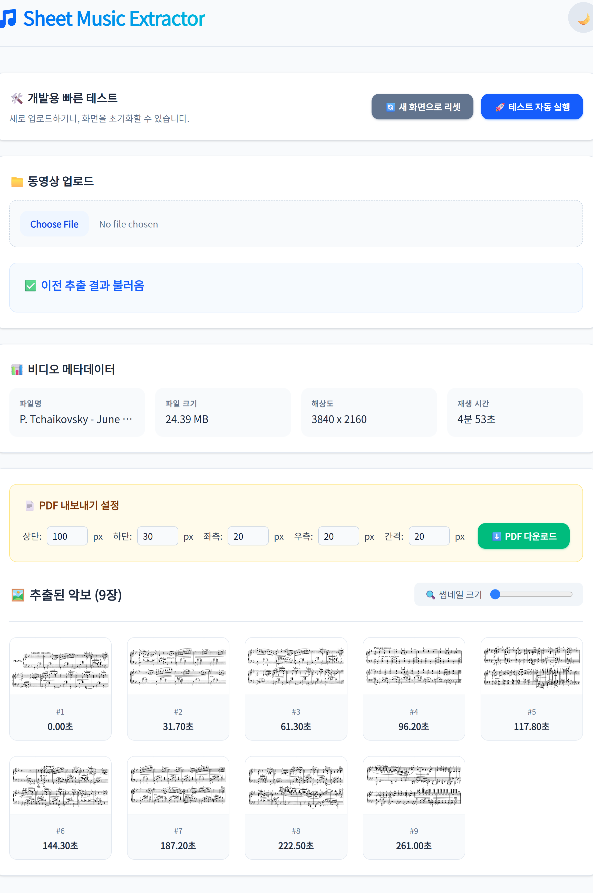

# 🎵 Sheet Music Keyframe Extractor

[한국어 번역](README-ko.md) · [한국어로 보기](README-ko.md)

Extract clean, printable sheet music from performance videos automatically — private, fast, and designed for musicians who want to practice without the pause button.

## 📖 Overview

Watching a great performance should inspire practice, not frustration. This project extracts sheet-music frames from videos and turns them into clean, A4-ready PDFs so you can focus on playing.

## ✨ Key Features

- Auto-detect and auto-crop sheet-music regions to remove visual clutter.
- Interactive ROI selection with drag-to-select and toggle on/off.
- Robust image-processing pipeline combining OpenCV preprocessing and heuristics/AI to detect page turns and reduce false positives.
- Background processing for long-running video analysis so the UI stays responsive.
- Pick-and-order extracted frames for PDF export (A4-ready, margin control).
- MD5-based deduplication and caching to avoid reprocessing duplicate uploads.

## ✨ Advantages (Features & Highlights)

This project separates powerful backend processing from an interactive frontend experience — each side is optimized for musicians who want accurate, fast, and convenient sheet-music extraction from video.

### Backend Advantages

- **Auto-crop & Intelligent ROI extraction:** Automatically detect and crop the sheet-music region. Users can define an ROI so only the desired music area is extracted; ROI drag-to-select and toggle on/off are supported.
- **Advanced image processing & AI techniques:** Combines OpenCV-based noise reduction and image preprocessing with AI/heuristics to detect real page turns. Robust even on low-quality videos.
- **User-controlled PDF composition:** Let users pick which extracted frames to include in an A4 printable PDF; supports ordering and margin adjustments.
- **Background-first architecture:** Video frame analysis and keyframe extraction run as FastAPI BackgroundTasks so the UI remains responsive during heavy processing.
- **Smart deduplication & caching:** Uses MD5 hashing and local caching to avoid reprocessing the same uploads, saving time and compute.
- **Efficiency & scalability-ready:** Optimized OpenCV processing, frame-skipping, and a lightweight DB cache enable fast local performance (easily extensible to Redis/Celery/Postgres).
- **Reliability & robustness:** Temporary file/cache management, retry strategies, and stable keyframe storage ensure robust long-running processing.

### Frontend Advantages

- **Live video playback & preview:** Play uploaded videos in the frontend and watch extraction progress and thumbnails update in real time.
- **Interactive ROI selection & drag on/off:** Interactive ROI selection with drag-to-select and the ability to toggle ROI on/off — extract only the area you want.
- **Image selection UI for PDF export:** View extracted thumbnails in a grid, include/exclude images, reorder them, and export directly to PDF.
- **Responsive, intuitive gallery:** Thumbnail resizing, preview zoom, and per-image delete options in a responsive React gallery.
- **Quick test-upload flow:** Place a test video at `frontend/public/data/test_video.webm` and use the UI's auto-upload test action to run quick iterations during development.
- **User convenience & accessibility:** One-click upload, progress indicators, and clear error/log messages for a friendly user experience.

### Cross-cutting Benefits

- **User-centric UX:** Smooth upload → process → review → PDF workflow makes it easy for non-technical users.
- **Performance-conscious design:** Avoids unnecessary frame analysis; caching and background-task separation keep desktop performance responsive.
- **Extensible architecture:** Currently uses SQLite + BackgroundTasks for single-user/local use, but the architecture is easily extensible to message brokers, task queues, and RDBMS for multi-user deployments.
- **Privacy-friendly:** Processing and result generation are designed to run locally by default, minimizing the need to send sensitive video data externally.
- **Developer-friendly:** Clean module layout (`app/api`, `app/services`, `app/core`, `frontend/src`) makes it easy to add features and maintain the codebase.

## 👥 Target Audience

- **Musicians & Instrumentalists:** Anyone who wants to practice offline or from printed sheets.
- **Hobbyists & Educators:** Quickly generate teaching materials or personal printouts from performance videos.

> Note: The current architecture (SQLite + FastAPI BackgroundTasks) is optimized for personal/local use. For multi-user public deployments consider adding a message broker (Redis), task queue (Celery), and an RDBMS (Postgres).

## 📸 Screenshots

Uploading a video and tracking the background extraction progress in real time. View extracted keyframes in a gallery and export them to a printer-ready PDF.

**User interface(web browser)**



**Generated PDF(only showing first two pages)**


## 🚀 How to Run (Step-by-Step Guide)

Follow these easy steps to get the project running on your local machine.

### Prerequisites

- `Python 3.8+`
- `Node.js`
- `uv` (An ultra-fast Python package installer / resolver)

### 1. Clone the repository

```bash
git clone https://github.com/yourusername/sheet-music-extractor.git
cd sheet-music-extractor
```

### 2. Backend setup (FastAPI)

```bash
# Navigate to the backend directory
cd backend

# Create a virtual environment using uv
uv venv

# Activate the virtual environment (Windows)
.venv\Scripts\activate
# Activate the virtual environment (Mac/Linux)
# source .venv/bin/activate

# Preferred: sync pinned dependencies using uv (reads lockfile)
uv sync

# Alternative: install from requirements.txt or pyproject
uv pip install -r requirements.txt
# or
python -m pip install -r requirements.txt

# Run the backend server
uv run uvicorn app.main:app --reload
```

The backend API will be available at `http://localhost:8000`.

Troubleshooting tips (if dependency installation fails):

- Upgrade pip/setuptools/wheel before installing:

```bash
python -m pip install -U pip setuptools wheel
```

- If `uv` commands fail, ensure `uv` is installed globally (or use plain `pip`):

```bash
python -m pip install --user uv
# or use pipx: pipx install uv
```

- Common issues with OpenCV on Windows:

  - Try `pip install opencv-python-headless` first. If that fails, try `pip install opencv-python` or install via conda: `conda install -c conda-forge opencv`.

  - If compilation/build errors appear, install the "Build Tools for Visual Studio" (C++), or use prebuilt wheels via conda.

- If Pillow or other compiled packages fail to build, ensure you have system build tools installed (Windows: Visual C++ Build Tools; macOS: Xcode command line tools; Linux: build-essential).

- If you see "no matching distribution" or wheel incompatibilities, try upgrading `pip`, or use `--platform`/`--only-binary` options, or switch to a compatible Python version (3.8+ recommended).

- If installation hangs or times out behind a proxy, configure pip proxy settings or download wheels manually.

- As a last resort, create the virtual environment with `python -m venv .venv` and use plain `pip` to install packages.

If you want, I can add exact commands for common error messages you encounter — paste the error output and I'll suggest the most targeted fix.

### 3. Frontend setup (React + Vite)

Open a new terminal at the project root:

```bash
# Navigate to the frontend directory
cd frontend

# Install Node dependencies
npm install

# Start the development server
npm run dev
```

Open `http://localhost:5173` to access the UI.

---

Enjoy playing! 🎹🎻
