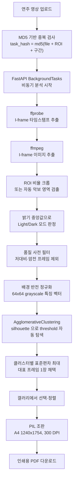

# Sheet Music Extractor: 연주 영상에서 A4 인쇄용 악보 PDF까지

> 디렉터(Mike)가 2026년 6월 16일간 단독 개발한 로컬 전용 영상 처리 파이프라인을,
> Aether Turing Dynamics(ATD)가 편입하여 전수 분석·감사·문서화한 기술 케이스 스터디입니다.

---

## 1. 프로젝트 목적 및 배경 (Goal & Mission)

### 해결 과제: 연주 영상으로는 연습할 수 없다

연주 영상을 보며 악보를 익히는 사람은 같은 마디를 수십 번 되감습니다. 필요한 악보는 화면에 잠깐 머물다 넘어가고, 화면 캡처로는 악보 영역만 깔끔하게 뜯어낼 수 없습니다. 기존 방식은 영상 편집기에서 프레임을 수동 캡처하고, 이미지 편집기에서 악보 영역을 크롭하고, 다시 PDF로 묶는 3단 수작업입니다. 30분짜리 연주 영상에서 인쇄용 악보를 만들려면 몇 시간이 걸립니다.

### 프로젝트 핵심 목표

1. 영상에서 악보가 표시된 프레임만 자동으로 추출한다.
2. 악보 영역을 자동 검출·크롭하여 레터박스와 배경을 제거한다.
3. 추출된 프레임을 골라 A4 인쇄용 PDF로 합성한다.
4. 모든 처리를 로컬에서 수행하여 연주 영상을 외부로 전송하지 않는다.



---

## 2. 개발 및 ATD 편입 경과

### 2-1. 디렉터 단독 개발 (2026.06.08 ~ 2026.06.23)

디렉터가 16일간 단독으로 설계부터 실행 스크립트까지 완성했습니다. 총 34 커밋, 최종 코드 규모는 백엔드 애플리케이션 Python 964행과 프론트엔드 소스 JS/JSX 1,544행입니다. 외부 라이브러리 의존을 최소화하는 방향으로 진행되어, 프론트엔드에는 라우터·상태관리·HTTP 클라이언트·PDF 라이브러리가 모두 들어가지 않았습니다.

개발은 두 구간으로 나뉩니다. 6월 8일부터 17일까지 기본 파이프라인과 PDF 조판을 완성했고, 6월 19일부터 23일까지 추출 품질을 다시 손봤습니다. 후반 작업에서 배경 반전 정규화, 품질 기반 사전 필터, 대표 프레임 선정 기준 변경, 실시간 진행률이 들어갔습니다.

### 2-2. ATD 허브 편입 (2026.09.20)

6월 완성 이후 방치되어 있던 저장소를 ATD 허브에 편입했습니다. 이 프로젝트는 ATD 편성 하에 개발된 것이 아니므로, ATD는 기능 구현에 참여하지 않았습니다. 대신 편입 시점의 코드베이스를 전수 분석하고 감사하여 문서화했습니다.

| 단계 | 담당 | 수행 내용 |
| :--- | :--- | :--- |
| 전수 분석 | Atlas | 코드베이스 구조·알고리즘·이력 분석, 편입 파이프라인 편성 |
| 아키텍처 명세 | Leo | 호출 그래프 및 데이터 흐름 정리, 개선 백로그 도출 |
| 결함 해소 | Kai | 삭제 엔드포인트 메서드 전환 및 프론트엔드 호출부 정합화 |
| 에셋 제작 | Sora | 세로 장첩 스크린샷에서 대표 썸네일 크롭 및 에셋 제작 |
| 감사 | Elena | README 서술과 실제 구현의 불일치 전수 적발, 시크릿/PII 감사 |
| 검증 | Noah | 빌드 무결성 및 실행 환경 재현성 확인 |

---

## 3. 시스템 아키텍처 및 핵심 기술

### 3-1. 백엔드 API

FastAPI 단일 프로세스에 SQLite를 물린 구조입니다. 라우터 prefix는 `/api/videos`이며 엔드포인트는 4개뿐입니다.

| Method | Path | 파일:행 | 용도 |
| :--- | :--- | :--- | :--- |
| POST | `/api/videos/upload` | `endpoints.py:256` | 업로드, task_hash 중복 검사, 백그라운드 분석 등록 |
| GET | `/api/videos/{video_id}` | `endpoints.py:323` | 상태·진행률·키프레임 조회 (프론트 2초 폴링) |
| GET | `/api/videos/{video_id}/pdf` | `endpoints.py:328` | PDF 생성 또는 캐시 반환 (마진, 프레임 목록 쿼리) |
| DELETE | `/api/videos/{video_id}` | `endpoints.py:373` | 비디오·키프레임·PDF·캐시 연쇄 삭제 |

데이터 모델은 `videos`와 `keyframes` 두 테이블입니다. `videos`는 파일 해시에 unique 제약을 걸어 중복 업로드를 차단하고, `keyframes`는 cascade delete-orphan으로 부모 삭제 시 함께 정리됩니다. 6월 19일 작업에서 ROI 비율과 시간 구간을 레코드에 영속화하는 필드 6개(`crop_x`, `crop_y`, `crop_w`, `crop_h`, `start_time`, `end_time`)가 추가되었습니다(`models/video.py:24-30`, `schemas/video.py:26-32`). 재업로드 없이 동일 `task_hash` 결과를 복원하기 위한 것입니다.

### 3-2. 악보 영역 자동 검출 (`extractor.py:92`)

사용자가 ROI를 지정하지 않아도 동작하도록 OpenCV 기반 투영(projection) 기법을 조합했습니다. 사람이 눈으로 "악보가 있는 네모"를 찾는 과정을 픽셀 밀도 계산으로 옮긴 구현입니다.

1. GaussianBlur(3,3)로 노이즈를 누그러뜨리고 grayscale로 변환
2. `THRESH_BINARY_INV` + `THRESH_OTSU`로 자동 임계 이진화 (조명 편차를 임계값 자동 산출로 흡수)
3. 행·열 밀도 50% 임계로 레터박스 경계를 찾고, 경계에서 안쪽 15px를 안전 여백으로 확보
4. 행·열 픽셀 합 투영으로 악보 내용에 타이트하게 맞춤
5. 픽셀 합 허용치 `255 × 15`로 잔노이즈를 무시하고 최종 10px 마진 확장

PDF 단계에서는 `trim_white_margin`(`endpoints.py:41`)이 PIL로 grayscale 240 미만 마스크의 bbox를 잘라, 스캔본 특유의 흰 테두리를 한 번 더 제거합니다.

### 3-3. 키프레임 선별: 6월 23일 재설계

이 프로젝트에서 가장 공을 들인 부분입니다. 핵심 아이디어는 "영상에서 화면이 바뀌는 순간은 I-frame 근처에 몰려 있다"는 관찰이고, 그 위에 6월 23일 작업으로 네 가지 보정이 얹혔습니다.

#### 3-3-1. I-frame 후보 추출

- `ffprobe -skip_frame nokey`로 I-frame 타임스탬프만 뽑고, 사용자가 지정한 시작·종료 구간으로 필터링합니다 (`extractor.py:38`).
- `ffmpeg select='eq(pict_type,PICT_TYPE_I)'`로 해당 프레임을 JPEG로 덤프합니다 (`extractor.py:57`).

전체 프레임을 디코딩하지 않으므로 연산량이 크게 줄어듭니다.

#### 3-3-2. 품질 기반 사전 필터 (`extractor.py:272`, `:276`)

클러스터링에 들어가기 전에 노이즈 프레임을 걸러냅니다. 인트로·페이드 전환·검은 아웃트로 화면이 클러스터링을 오염시키는 문제를 입력 단계에서 제거하는 접근입니다.

- 표준편차가 20.0 미만인 저대비 프레임을 제외합니다 (`extractor.py:272`).
- Light 모드 영상에서 평균 밝기가 150.0 미만인 암전 프레임을 제외합니다 (`extractor.py:276`).

#### 3-3-3. 배경 반전 정규화 (`extractor.py:263`, `:282`)

악보는 흰 배경에 검은 음표입니다. 이 상태로 코사인 유사도를 재면 밝은 흰 배경이 벡터를 지배해, 실제 음표와 오선의 구조 차이가 묻힙니다. 그래서 크롭 프레임 전체의 평균 밝기 중앙값이 127.0을 넘으면 Light 모드로 판정하고(`extractor.py:263`), 특징 벡터를 반전시킵니다(`extractor.py:282`).

```python
feature_vector = (255 - small_gray) if global_light_mode else small_gray
```

배경을 어둡게 뒤집으면 유사도 계산이 음표와 오선의 겹침에 집중됩니다. 악보와 악보가 아닌 화면의 구분력이 올라가는 지점입니다.

#### 3-3-4. 클러스터링과 대표 프레임 선택 (`extractor.py:157`, `:305`)

- 64×64 grayscale로 축소한 특징 벡터에 `AgglomerativeClustering` cosine 거리, average linkage를 적용합니다.
- 거리 임계값은 고정하지 않고 후보 `[0.05, 0.08, 0.1, 0.12, 0.15, 0.18, 0.2]`에 대해 silhouette score를 계산해 자동 선택합니다. 기본값은 0.15입니다 (`extractor.py:157-158`). 후보 배열과 기본값 모두 6월 23일 이전 값(`[0.01 … 0.1]`, 0.03)에서 상향 조정된 것입니다 (변경 커밋 `7f03a69`).
- 대표 프레임은 클러스터의 첫 프레임이 아니라 표준편차가 가장 큰 프레임입니다 (`extractor.py:305-307`).

```python
best_idx = max(indices, key=lambda idx: valid_stds[idx])
```

표준편차가 크다는 것은 배경과 기보의 대비가 선명하다는 뜻입니다. 페이지가 넘어가는 흐릿한 중간 프레임을 대표로 뽑는 사고를 막습니다. 선정 후에는 원본 인덱스 기준으로 다시 정렬해 타임라인 순서를 복원합니다 (`extractor.py:310`).

#### 3-3-5. 남는 한계

이 구조는 여전히 "비슷한 프레임을 묶는" 작업이지 "악보가 넘어갔는지 판정하는" 작업이 아닙니다. 악보가 넘어가지 않고 연주자만 움직인 구간도 별개 클러스터로 갈라질 수 있습니다. 또한 silhouette 후보가 조건(`1 < n_clusters < len(X)`)을 하나도 만족하지 못하면 경고 없이 기본값 0.15로 폴백합니다 (`extractor.py:158-173`). 프레임이 단일 클러스터로 뭉개지는 상황을 탐지할 장치가 없다는 뜻이며, 편입 감사에서 지적사항으로 기록했습니다.

### 3-4. 중복 제거 및 캐싱

같은 영상을 다른 ROI로 다시 올리는 경우까지 고려한 2단 해시 구조입니다 (`endpoints.py:269`).

- `base_file_hash`: 파일 내용 MD5 (8192바이트 청크 스트리밍)
- `task_hash`: `md5(base_file_hash + crop_x + crop_y + crop_w + crop_h + start_time + end_time)`

`task_hash`가 일치하는 기존 레코드가 있으면 분석을 건너뛰고 즉시 반환합니다. 파일 자체는 `{base_file_hash}_{원본파일명}`으로 한 번만 저장하고 여러 레코드가 공유합니다. I-frame 캐시는 `storage/cache/iframes/{base_file_hash}_{start}_{end}`에 남고, `timestamps.txt`와 `iframe_*` 파일이 모두 있으면 캐시 히트로 판정해 복사만 수행합니다.

삭제 시에도 공유 카운트를 먼저 확인합니다. 같은 원본 파일을 참조하는 레코드가 1개 이하일 때만 원본과 캐시 디렉토리를 지웁니다. 다른 ROI 설정이 남아 있는데 원본이 사라지는 사고를 막는 장치입니다.

### 3-5. PDF 조판

Pillow로 A4 캔버스(`1240 × 1754`)에 이미지를 순서대로 배치합니다. 저장 시 `resolution=300.0`을 지정하므로 실효 해상도 기준의 캔버스입니다.

- 캐시 파일명에 마진 5종(상·하·좌·우·내부)과 프레임 ID 목록을 인코딩해, 설정이 다르면 별도 PDF가 생성됩니다 (`endpoints.py:99`).
- 페이지 넘침 판정은 단순합니다. 현재 y좌표에 이미지 높이를 더한 값이 `페이지 높이 - 하단 마진`을 넘으면 새 페이지로 넘깁니다.
- 페이지 번호는 우상단에 흰 배경·검정 테두리 박스로 찍고, 폰트는 arial → DejaVuSans → Pillow 기본 폰트 순으로 폴백합니다 (`endpoints.py:55`). OS별 폰트 부재로 조판이 죽지 않게 한 처리입니다.

### 3-6. 프론트엔드

React 19 + Vite 8 + Tailwind CSS v4 조합이며, 상태관리 라이브러리 없이 `useState`/`useEffect`/`useRef`만 사용합니다. 26개의 `useState`와 다수의 `useRef`로 구성되어 있고, 테마·레이아웃 폭·썸네일 크기·스냅 설정·마진 설정은 localStorage에 영속화됩니다.

주목할 구현은 ROI 선택기입니다. 8방향 리사이즈 핸들을 두고, `requestAnimationFrame` 기반으로 포인터 이동 시 오버레이 갱신을 프레임 단위로 조율합니다. 그리드·가장자리 스냅도 함께 동작합니다. 확대 미리보기 모달은 좌→우 페이드/슬라이드 전환과 키보드 `←`/`→`/`Home`/`End`/`Esc` 내비게이션을 지원합니다.

6월 23일 작업에서 진행률 표시가 정적 점프 방식에서 실제 프레임 처리 루프 기반 계산으로 바뀌었습니다(`extractor.py:255-256`, `:331-332`).


---

## 4. ATD 편입 감사 결과

편입 감사에서 19건을 적발했습니다. 이 중 1건은 편입 과정에서 해소했고, 나머지 18건은 코드를 수정하지 않은 채 개선 백로그로 이관했습니다. 백로그 번호는 프로젝트 명세서(`PROJECT-DESCRIPTION.md` §4.2)의 BL-01 ~ BL-18과 대응하며, 총계는 §4-8에 정리했습니다.

### 4-1. 서술과 구현의 불일치

README가 안내하거나 설명하는 기능 중 실제 코드에 없는 항목입니다. 인수인계 문서로서 README의 신뢰도에 직접 영향을 주는 문제입니다. 6건 모두 잔존합니다.

| README 서술 | 실제 구현 상태 |
| :--- | :--- |
| 설치 절차와 Prerequisites | `requirements.txt` 파일 자체가 없음(`pyproject.toml` + `uv.lock`만 존재). Prerequisites는 `Python 3.8+`(`README.md:80`)로 적혀 있으나 실제 요구는 `>=3.12`(`pyproject.toml:6`)이고, 하드 런타임 의존인 `ffmpeg`/`ffprobe`가 README 전체에서 0건 |
| 개별 이미지 삭제 기능 (`README.md:44`) | 프론트엔드에 삭제 UI 없음. 백엔드에도 개별 키프레임 삭제 라우트 없음 |
| 이미지 순서 바꾸기 (`README.md:43`) | 재정렬 UI 없음. 체크된 인덱스를 오름차순 정렬해 전송함 |
| 테스트 영상 자동 업로드 버튼 (`README.md:45`) | 참조 없음. `frontend/public/data/` 디렉토리도 없음 |
| 재시도 전략 (`README.md:37`) | retry/backoff 로직 0건. 해당 문자열은 README 자기 자신에만 등장 |
| 페이지 넘김 검출 과장 | backend 불릿은 6월 23일에 "Intelligent Pipeline Optimization" 으로 교체됐으나, Key Features(`README.md:15`)에 "heuristics/AI to detect page turns" 옛 문구가 그대로 남음. 또한 `README.md:29`의 "Outlier-Resistant Silhouette Clustering"은 silhouette 계산에 이상치 저항 구현이 없어 과장임 |

### 4-2. ATD 코드 품질 물리 제약 위반

| 대상 | 실측 | 제약 |
| :--- | :--- | :--- |
| `frontend/src/App.jsx` | 1,534행, 하위 컴포넌트 0개 | 파일 300행 |
| `backend/app/api/endpoints.py` · `backend/app/services/extractor.py` | 424행 · 399행 | 파일 300행 |

`App.jsx`는 단일 `App()` 컴포넌트 안에 UI·상태·유틸·스타일 문자열 상수가 모두 들어 있습니다. 6월 작업으로 1,349행에서 1,534행으로 더 커졌습니다.

### 4-3. 보안 및 견고성

| 항목 | 내용 |
| :--- | :--- |
| 비멱등 삭제 | 삭제가 `GET`으로 노출되어 링크 프리페치·CSRF에 노출 (편입 시 `DELETE`로 전환 완료) |
| 오리진 하드코딩 | `allow_origins=["http://localhost:5173"]`(`main.py:25`), 프론트 API 주소 `http://localhost:8000`(`App.jsx:89`) |
| 작업 유실 | `BackgroundTasks` 단일 프로세스 구조라 서버 재시작 시 진행 중 분석이 소실됨 |
| 오류 은폐 | 예외를 print만 하고 status만 failed로 기록(`extractor.py:390`). 에러 메시지 미저장, 재시도 없음 |
| 삭제 실패 무음 처리 | `remove_readonly`가 `except Exception: pass`로 실패를 삼켜(`endpoints.py:379-384`), 파일 삭제가 실패해도 API가 성공을 반환할 수 있음 |
| 비권장 API | `sqlalchemy.ext.declarative.declarative_base` 사용(`database.py:3`, `:14`) |

### 4-4. 검증 자산 부재

자동 테스트가 0건입니다. pytest·unittest·assert 사용이 없고 테스트 프레임워크도 의존성에 없습니다. `backend/test_strategy.py`는 argparse로 비디오 경로를 받아 추출 코어를 호출하고 stdout으로 결과를 출력하는 수동 CLI 하네스이며, `backend/test_minimal.py`는 실행 블록조차 없는 5행 스텁입니다. 두 파일 모두 assert가 0개입니다. 자동 판정이 없으므로 회귀를 감지할 장치가 없습니다.

### 4-5. 잔재 및 부정합 파일

`frontend/pyproject.toml`은 uv가 잘못 생성한 잔재입니다. `requires-python = ">=3.14"`, dependencies 없음, description이 "Add your description here"로 남아 있어 npm 기반 프론트엔드 디렉토리에 Python 프로젝트 정의가 섞여 있습니다.

별개로 `backend/pyproject.toml:5`의 `readme = "README.md"`는 존재하지 않는 `backend/README.md`를 가리킵니다. 루트 `README.md`는 있으나 backend 디렉토리에는 없습니다.

`backend/test_strategy.py:74`의 안내 문구는 아직 `distance_threshold` 기본값을 0.03으로 표기합니다. 실제 값은 0.15입니다.

### 4-6. 배포 및 운영 인프라 부재

`Dockerfile`, `docker-compose`, `.github/`, `Makefile`이 모두 없고 프로젝트 전체에 `yml`/`yaml` 파일이 0건입니다. 빌드·린트·테스트를 자동으로 돌리는 파이프라인이 없어 회귀를 감지할 자동화 계층이 전혀 없습니다. 외부 바이너리 `ffmpeg`/`ffprobe` 의존이 시스템 명세로 고정되어 있지 않고 README의 Prerequisites에도 누락되어 있어, 다른 환경에서는 수동 설치가 필요합니다.

### 4-7. silhouette 폴백 무경고

`extractor.py:158-173`에서 후보 임계값이 전부 조건(`1 < n_clusters < len(X)`)을 만족하지 못하면 경고 없이 기본값 0.15로 폴백합니다. 모든 프레임이 단일 클러스터로 뭉개지는 상황을 탐지하거나 알릴 수단이 없습니다.

### 4-8. 감사 총계

| 구분 | 건수 |
| :--- | :--- |
| 적발 | 19 |
| 편입 과정에서 해소 (비멱등 삭제 전환 및 프론트엔드 호출부 정합화) | 1 |
| 개선 백로그 이관 | 18 |

---

## 5. 결론 및 향후 확장

Sheet Music Extractor는 16일 단독 개발로 "영상 → 인쇄용 악보 PDF"라는 개인적 불편을 실제로 해소한 도구입니다. 2,508행 규모에서 얻기 어려운 완성도가 두 군데 있습니다.

첫째는 악보 영역 자동 검출입니다. 조명 편차를 Otsu 임계값 자동 산출로 흡수하고, 행·열 픽셀 투영으로 내용에 타이트하게 맞춘 뒤, 잔노이즈 허용치와 안전 여백까지 상수로 고정했습니다. 실사용에서 부딪힌 문제를 정면으로 다룬 흔적입니다.

둘째는 6월 23일의 키프레임 선별 재설계입니다. 흰 배경이 코사인 유사도를 지배하는 문제를 배경 반전으로 해결하고, 인트로·페이드·아웃트로 화면을 사전 필터로 걷어내고, 대표 프레임을 첫 장이 아니라 대비가 가장 선명한 장으로 고르도록 바꿨습니다. "왜 이 프레임이 잘못 뽑히는가"를 관찰하고 원인별로 대응한 순서가 코드에 남아 있습니다.

동시에 편입 감사는 이 프로젝트가 개인 도구로는 충분하지만 인수인계 가능한 소프트웨어는 아니라는 점을 드러냈습니다. README가 안내하는 설치 절차가 깨져 있고, 문서가 설명하는 기능 6건이 코드에 없으며, 자동 테스트가 0건입니다. `App.jsx` 1,534행 단일 컴포넌트는 기능 추가보다 유지보수를 먼저 막는 구조입니다.

ATD는 이 상태를 정직하게 기록하는 쪽을 택했습니다. 감사에서 적발한 항목은 삭제하지 않고 개선 백로그로 프로젝트 명세서에 이관했으며, README의 과장 서술도 그대로 둔 채 불일치 사실을 문서화했습니다. 다음 작업의 우선순위는 프로젝트 명세서(`PROJECT-DESCRIPTION.md` §4.3)에 정리되어 있습니다.

이 케이스는 ATD 편입 프레임의 성격을 잘 보여줍니다. 편입은 기존 프로젝트에 ATD의 이름을 붙이는 일이 아니라, 그 프로젝트가 실제로 무엇인지 밝히고 다음 사람이 이어받을 수 있게 만드는 일입니다.
